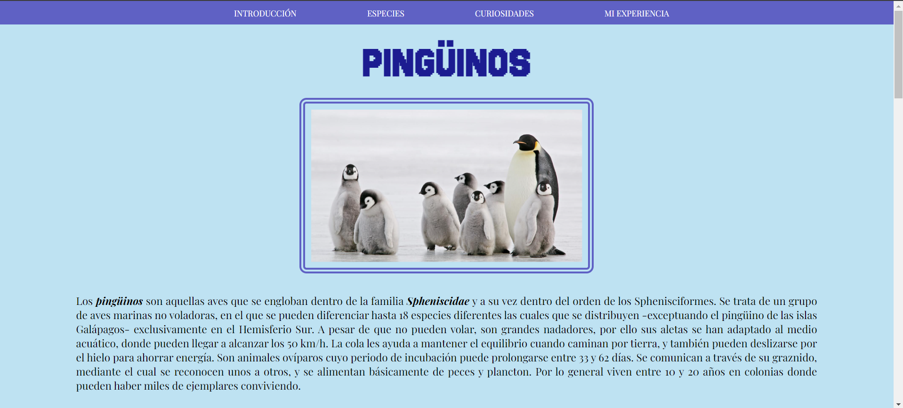

# Página web sobre pingüinos

Esta página web contiene información sobre los pingüinos, sus diferentes especies, entre otros datos, fue creado con HTML5 y CSS3.

## Características

- **Interfaz de Usuario Intuitiva:** Navegación fácil y accesible.

- **Iconografía y Estilos Modernos:** Uso de iconos y estilos modernos para una apariencia agradable.

## Tecnologías Utilizadas

- **HTML5:** Para la estructura básica del sitio.
  
- **CSS3:** Para el diseño y el estilo.

## Vista previa del proyecto

### Contacto
Si te gustaria invitarme a colaborar en un proyecto, contáctame a mi córreo meli178a@gmail.com o escribeme por [LinkedIn](https://www.linkedin.com/in/melissa-ochoa17/)
